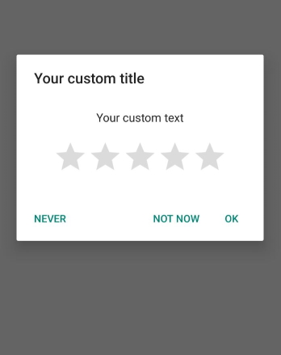

## BetterRateDialog Library

BetterRateDialog is a library that allows our users to display set rating dialogs with custom behavior

You can set up behavior like:

		if (Rating >= 4-Stars) {
				open (StoreEntry/InAppReview) to get rating
			} else {
				(Ask for Mail Feedback) or (Trigger an event)
			} 




## Features

 - Supports Google Play & Amazon Store
 - Supports Google Play InAppReviews
 - Customizable Text, Buttons, EventListeners
 - Customizable Star colors
 - E-Mail feedback

## Installation

To use the library, first include it your project using Gradle:


    allprojects {
        repositories {
            jcenter()
            maven { url "https://jitpack.io" }
        }
    }

	dependencies {
	        implementation 'com.github.MRZ07:BetterRateDialog:-SNAPSHOT'
	}


## Usage

The `showAfter(int number, ShowMode)` method can be used to display the dialog after a certain behavior and its number of occurrences.

Currently  supported ShowModes:

 - DAYS
 - LAUNCH_TIMES

Example:

```java
        BetterRateDialog betterRateDialog = new BetterRateDialog(this, "your@mail.com");
        betterRateDialog.setRateText("Your custom text")
                .setTitle("Your custom title")
                .setForceMode(false) /*Open store entry without asking the User*/
                .setUpperBound(3) /*If Rating >= 3 open (StoreEntry/InAppRating)*/
                .setNegativeReviewListener(this) /*Custom Listener which overrides Mail Intent*/
                .setReviewListener(this) /*Custom ReviewListener*/
                .setGooglePlayInAppReviewMode(true) /*Open InAppReview for Google Play Apps*/
                .showAfter(ShowMode.LAUNCH_TIMES, 2); /*The condition when to display it*/

```
To display the dialog manually you can use:

    .show(); /*Can be used to display the dialog manually*/

## Keep in mind
* When the user tap **OK** or **NEVER** the dialog will not show again
* When the user tap **NOT NOW** the access counter will be reset and the dialog will be shown again after the selected times.

## Honorable Mentions
This Library is an improved version of:
https://github.com/Angtrim/Android-Five-Stars-Library

## License

Do what you want with this library.
